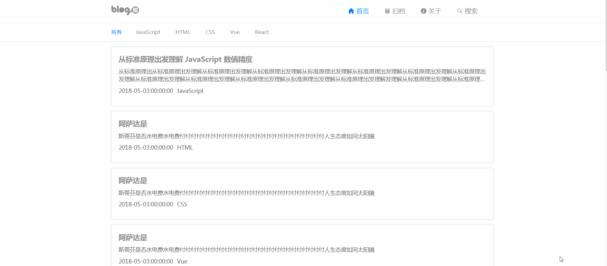
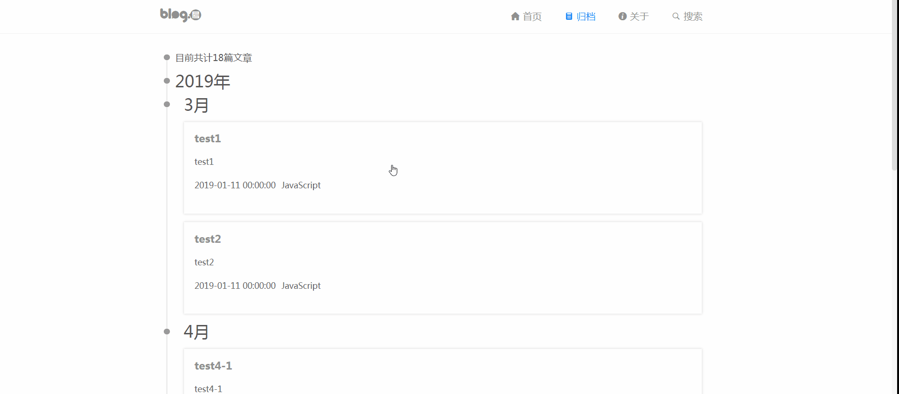

# React 学习项目 · 简易博客


### 版本更迭
> 2019/01/29 &nbsp; React-blog1.0正式版本

## <a name="features">技术栈</a>
> 详情可参阅 `package.json`
* 基于create-react-app
* React 16.6.1
* Redux
* React Router4.v
* 计划fetch
* ES6

***

## <a name="getting-started">开始</a>
在开始前，希望您已通读如下资料

* [React 文档][https://reacttraining.com/react-router/web/guides/quick-start]
* [React Router 文档][https://react.docschina.org/]

同时您还应该熟悉 ES6。[http://es6.ruanyifeng.com/]
或者通读MDN [https://developer.mozilla.org/zh-CN/docs/Web/JavaScript]

### <a name="install">安装</a>
在`react-blog` 的命令窗口下，运行 `npm install`  
直到依赖安装完成  

### <a name="start">启动</a>
在`react-blog` 的命令窗口下，运行 `npm start`  
浏览器会自动打开 `localhost:3000`，此时即可预览整个项目  

### <a name="notice">注:</a>
如需手动配置webpack,可执行命令npm run eject  
然后耐心等待即可  

## <a name="architecture">项目架构</a>
### <a name="tree">目录结构</a>
```
.
├─ public/            # Webpack 配置目录
│   ├─ iconfont      # icon
│   ├─ index.html    # 静态基页
├─ dist/             # build 生成的生产环境下的项目
├─ src/              # 源码目录（开发都在这里进行）
│   ├─ api/         # 请求接口等配置文件
│   ├─ assets/         # 放置需要经由 Webpack 处理的静态文件
│   ├─ components/     # 组件（COMPONENT）
│   ├─ layouts/        # 全局布局
│   ├─ pages/          # 视图页面
│   ├─ store/          # Redux
│   │   ├─ reducers/     # （REDUCER文件夹）
│   │   ├─ actions/      # （ACTION）
│   │   ├─ store/        # （STORE）
│   ├── index.js         # 启动文件
│   ├── reset.css/       # 重置部分样式的css(也可以使用normalize.css)
│   ├── router.jsx       # 生成路由
│   ├── routerConfig.js  # 路由文件配置
│   ├── routerConfig.js  # PWA(可用可不用,create-react-app生成)
├── .gitignore       # （配置）需被 Git 忽略的文件（夹）
├── package.json     #  所依赖的包文件
├── package-lock.json #  锁定包的版本
```

### <a name="describe">简述</a>
* 本示例项目旨在学习React,踩React坑点
* 优化目录结构，更好的模块分离，组件化


## <a name="development">测试</a>
参考：
* Facebook [Jest 测试文档](https://jestjs.io/docs/en/getting-started)


## <a name="deployment">部署</a>
在 `react-demo` 的命令窗口下，敲下 `npm run build`，将会在项目根目录下生成 `dist/`
> 关于生产环境下的部署与优化，请自行查阅相关资料

***



